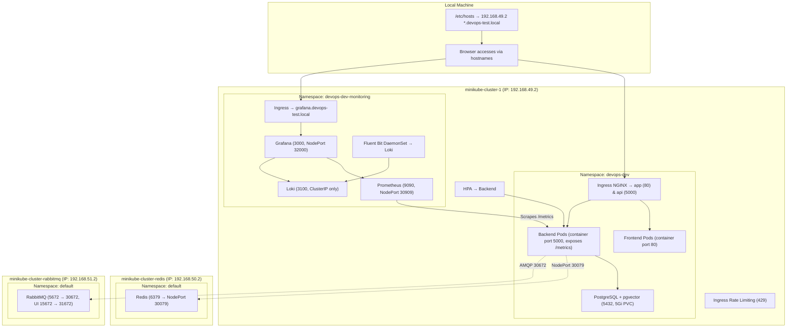

# DevOps Local Kubernetes Architecture

## Local Machine

Browser accesses services using hostnames mapped to the Minikube IP.

```
192.168.49.2  *.devops-test.local
```

## Architecture Diagram



## Namespaces

### devops-dev

- Frontend application
- Backend API with metrics
- PostgreSQL with pgvector
- Ingress NGINX
- HPA enabled
- Rate limiting

### devops-dev-monitoring

- Prometheus
- Grafana
- Loki
- Fluent Bit

## External Services

| Service  | Access                   |
| -------- | ------------------------ |
| Redis    | NodePort 30079           |
| RabbitMQ | 30672 (AMQP), 31672 (UI) |

## URLs

| Service  | URL                              |
| -------- | -------------------------------- |
| Frontend | http://app.devops-test.local     |
| Backend  | http://api.devops-test.local     |
| Grafana  | http://grafana.devops-test.local |
