# DevOps Local Kubernetes Architecture

## Local Machine

Browser accesses services using hostnames mapped to the Minikube IP.

```
192.168.49.2  *.devops-test.local
```

## Architecture Diagram

```mermaid
graph TD
    subgraph "Local Machine"
        Browser["Browser accesses via hostnames"]
        Hosts["/etc/hosts → 192.168.49.2 *.devops-test.local"]
    end

    subgraph "minikube-cluster-1 (IP: 192.168.49.2)"
        direction TB

        subgraph devops_dev["Namespace: devops-dev"]
            IngressApp["Ingress NGINX → app (80) & api (5000)"]
            Frontend["Frontend Pods (container port 80)"]
            Backend["Backend Pods (container port 5000, exposes /metrics)"]
            Postgres["PostgreSQL + pgvector (5432, 5Gi PVC)"]
        end

        subgraph devops_monitoring["Namespace: devops-dev-monitoring"]
            IngressGrafana["Ingress → grafana.devops-test.local"]
            Grafana["Grafana (3000, NodePort 32000)"]
            Prometheus["Prometheus (9090, NodePort 30909)"]
            Loki["Loki (3100, ClusterIP only)"]
            FluentBit["Fluent Bit DaemonSet → Loki"]
        end

        HPA["HPA → Backend"]
        RateLimit["Ingress Rate Limiting (429)"]
    end

    subgraph "minikube-cluster-redis (IP: 192.168.50.2)"
        subgraph redis_default["Namespace: default"]
            Redis["Redis (6379 → NodePort 30079)"]
        end
    end

    subgraph "minikube-cluster-rabbitmq (IP: 192.168.51.2)"
        subgraph rabbitmq_default["Namespace: default"]
            RabbitMQ["RabbitMQ (5672 → 30672, UI 15672 → 31672)"]
        end
    end

    Hosts --> Browser
    Browser --> IngressApp
    Browser --> IngressGrafana

    IngressApp --> Frontend
    IngressApp --> Backend
    IngressGrafana --> Grafana

    Backend --> Postgres
    Backend -.->|"NodePort 30079"| Redis
    Backend -.->|"AMQP 30672"| RabbitMQ

    Prometheus -->|"Scrapes /metrics"| Backend
    FluentBit --> Loki
    Grafana --> Prometheus
    Grafana --> Loki
    HPA --> Backend
```



## Namespaces

### devops-dev

- Frontend application
- Backend API with metrics
- PostgreSQL with pgvector
- Ingress NGINX
- HPA enabled
- Rate limiting

### devops-dev-monitoring

- Prometheus
- Grafana
- Loki
- Fluent Bit

## External Services

| Service  | Access                   |
| -------- | ------------------------ |
| Redis    | NodePort 30079           |
| RabbitMQ | 30672 (AMQP), 31672 (UI) |

## URLs

| Service  | URL                              |
| -------- | -------------------------------- |
| Frontend | http://app.devops-test.local     |
| Backend  | http://api.devops-test.local     |
| Grafana  | http://grafana.devops-test.local |


## 📸 Screenshots Overview

- **DevOps Cluster Overview**  
  All Minikube clusters running together.  
  

- **DevOps Pods**  
  Backend and Frontend pods in `devops-dev` namespace.  
  

- **Seed Data in Backend Pod**  
  Seed data applied inside backend pod.  
  

- **Redis Cluster Overview**  
  Redis running with NodePort.  
  

- **Ping Redis from DevOps Cluster**  
  Connectivity test from backend pod to Redis.  
  

- **RabbitMQ Cluster Overview**  
  RabbitMQ service running with NodePort.  
  

- **Ping RabbitMQ from DevOps Cluster**  
  Connectivity test from backend pod to RabbitMQ.  
  

- **Grafana Logs & Metrics**  
  Grafana showing logs and metrics dashboards.  
  
