# DevOps Local Kubernetes Architecture

## Local Machine

Browser accesses services using hostnames mapped to the Minikube IP.

```
192.168.49.2  *.devops-test.local
```

## Architecture Diagram

```mermaid
graph TD
    subgraph "Local Machine"
        Browser["Browser accesses via hostnames"]
        Hosts["/etc/hosts → 192.168.49.2 *.devops-test.local"]
    end

    subgraph "minikube-cluster-1 (IP: 192.168.49.2)"
        direction TB

        subgraph devops_dev["Namespace: devops-dev"]
            IngressApp["Ingress NGINX → app (80) & api (5000)"]
            Frontend["Frontend Pods (container port 80)"]
            Backend["Backend Pods (container port 5000, exposes /metrics)"]
            Postgres["PostgreSQL + pgvector (5432, 5Gi PVC)"]
        end

        subgraph devops_monitoring["Namespace: devops-dev-monitoring"]
            IngressGrafana["Ingress → grafana.devops-test.local"]
            Grafana["Grafana (3000, NodePort 32000)"]
            Prometheus["Prometheus (9090, NodePort 30909)"]
            Loki["Loki (3100, ClusterIP only)"]
            FluentBit["Fluent Bit DaemonSet → Loki"]
        end

        HPA["HPA → Backend"]
        RateLimit["Ingress Rate Limiting (429)"]
    end

    subgraph "minikube-cluster-redis (IP: 192.168.50.2)"
        subgraph redis_default["Namespace: default"]
            Redis["Redis (6379 → NodePort 30079)"]
        end
    end

    subgraph "minikube-cluster-rabbitmq (IP: 192.168.51.2)"
        subgraph rabbitmq_default["Namespace: default"]
            RabbitMQ["RabbitMQ (5672 → 30672, UI 15672 → 31672)"]
        end
    end

    Hosts --> Browser
    Browser --> IngressApp
    Browser --> IngressGrafana

    IngressApp --> Frontend
    IngressApp --> Backend
    IngressGrafana --> Grafana

    Backend --> Postgres
    Backend -.->|"NodePort 30079"| Redis
    Backend -.->|"AMQP 30672"| RabbitMQ

    Prometheus -->|"Scrapes /metrics"| Backend
    FluentBit --> Loki
    Grafana --> Prometheus
    Grafana --> Loki
    HPA --> Backend
```



## Namespaces

### devops-dev

- Frontend application
- Backend API with metrics
- PostgreSQL with pgvector
- Ingress NGINX
- HPA enabled
- Rate limiting

### devops-dev-monitoring

- Prometheus
- Grafana
- Loki
- Fluent Bit

## External Services

| Service  | Access                   |
| -------- | ------------------------ |
| Redis    | NodePort 30079           |
| RabbitMQ | 30672 (AMQP), 31672 (UI) |

## URLs

| Service  | URL                              |
| -------- | -------------------------------- |
| Frontend | http://app.devops-test.local     |
| Backend  | http://api.devops-test.local     |
| Grafana  | http://grafana.devops-test.local |


## 📸 Screenshots Overview

- **DevOps Cluster Overview**  
  All Minikube clusters running together.  
  

- **DevOps Pods**  
  Backend and Frontend pods in `devops-dev` namespace.  
  

- **Seed Data in Backend Pod**  
  Seed data applied inside backend pod.  
  

- **Redis Cluster Overview**  
  Redis running with NodePort.  
  

- **Ping Redis from DevOps Cluster**  
  Connectivity test from backend pod to Redis.  
  

- **RabbitMQ Cluster Overview**  
  RabbitMQ service running with NodePort.  
  

- **Ping RabbitMQ from DevOps Cluster**  
  Connectivity test from backend pod to RabbitMQ.  
  

- **Grafana Logs & Metrics**  
  Monitoring Pods.  
  

- **Grafana Logs & Metrics**  
  Grafana showing logs and metrics dashboards.  
  


## 📊 Adding Logs & Metrics Data Source in Grafana

### 1️⃣ Access Grafana

Open your browser and navigate to:  

```
http://grafana.devops-test.local
```

- Default credentials (if using default Minikube setup):
  - **User:** `admin`
  - **Password:** `admin` (or what you set in your deployment)

---

### 2️⃣ Add a Loki Logs Data Source

1. Click the **gear icon (⚙️) → Data Sources**.  
2. Click **Add data source**.  
3. Select **Loki**.  
4. Configure the URL:

```
http://loki.devops-test.svc.cluster.local:3100
```
  
5. Click **Save & Test**.  
   - Should show `Data source is working`.

---

### 3️⃣ Add a Prometheus Metrics Data Source

1. Go back to **Data Sources → Add data source**.  
2. Select **Prometheus**.  
3. Configure the URL:

```
http://prometheus.devops-test.svc.cluster.local:9090
```

4. Click **Save & Test**.  
   - Should show `Data source is working`.

---

### 4️⃣ Verify Logs & Metrics in Grafana

- Go to **Explore** in Grafana.  
- Select **Loki** as the data source to query logs.  
- Select **Prometheus** as the data source to query metrics.  
- You can now build dashboards or panels using both logs and metrics.


# Local Kubernetes Development Environment with Terraform and Kind

## Features

- Creates a local Kind cluster (Kubernetes v1.29.8)
- Deploys a dedicated namespace (`devops-dev`)
- Installs **nginx-ingress** controller via Helm
- Deploys:
  - Frontend  on port 80
  - Backend  on port 5000 
  - PostgreSQL secrets (username, password, DB name)

- Configures **Ingress** with two hosts:
  - `app.devops-test.local` → frontend
  - `api.devops-test.local` → backend

- Uses local Docker images with `imagePullPolicy: Never`

---


### Build and tag your Docker images

```bash
# Frontend
docker build -t frontend:latest ./frontend

# Backend
docker build -t backend:latest ./backend
```

### Initialize Terraform

```bash
terraform init
```

### Preview the plan

```bash
terraform plan
```

### Apply the configuration

```bash
terraform apply
# Type 'yes' when prompted
```

### Load images into Kind cluster

```bash
kind load docker-image frontend:latest --name kind-cluster-1
kind load docker-image backend:latest --name kind-cluster-1
```

---

## Accessing the Application

### Using Kind Node IP

   - Get the IP of the Kind control plane:

```bash
docker inspect kind-cluster-1-control-plane | grep IPAddress
```

   - Add the IP to your `/etc/hosts` file:

```
172.28.0.2 app.devops-test.local
172.28.0.2 api.devops-test.local
```

   - Access the applications in your browser using NodePort or mapped ports:

- Frontend: `http://app.devops-test.local:31207`  
- API: `http://api.devops-test.local:31207`  

## Cleanup

```bash
terraform destroy
```


## 📸 Screenshots

- **Kind Cluster Overview**  
  List of all clusters and nodes in the Kind setup.  
  

- **Terraform Setup & Application UI**  
  Terraform applied resources and the deployed application UI.  
  


## kubectl & Minikube Commands

### Check Current Context / Profiles

```bash
# List Minikube profiles
minikube profile list

# Alternative: see which cluster kubectl is using
kubectl config current-context
```

---

### Start Clusters

```bash
# DevOps application + monitoring cluster
minikube start -p devops-cluster \
  --driver=docker \
  --memory=8192 \
  --cpus=4

# Redis cluster
minikube start -p redis-cluster \
  --driver=docker \
  --memory=2048 \
  --cpus=2

# RabbitMQ cluster
minikube start -p rabbitmq-cluster \
  --driver=docker \
  --memory=2048 \
  --cpus=2
```

---

### Switch Between Profiles / Contexts

```bash
minikube profile devops-cluster
kubectl config use-context devops-cluster
kubectl config current-context
```

---

### Build Docker Images Inside Minikube

```bash
# Backend image
minikube --profile=devops-cluster image build -t backend:latest -f apiserver/Docker/Dockerfile.backend .

# Frontend image
minikube image build -t frontend:latest -f client/Docker/Dockerfile.frontend .
```

---

### Apply Kubernetes Manifests

```bash
# DevOps namespace
kubectl apply -n devops-dev -f k8s/app/
kubectl apply -n devops-dev-monitoring -f k8s/monitoring/

# Redis cluster
kubectl apply -n default -f k8s/redis/

# RabbitMQ cluster
kubectl apply -n default -f k8s/rabbitmq/

# Apply ingress for Minikube
kubectl apply -f k8s/minikube-ingress.yaml
```

---

### Add Domains to Hosts

```bash
# Single domain
echo "$(minikube ip) devops-test.local" | sudo tee -a /etc/hosts

# Multiple domains (frontend & API)
echo "$(minikube ip) app.devops-test.local api.devops-test.local" | sudo tee -a /etc/hosts
```

---

### Rollout Deployments

```bash
# Restart backend deployment
kubectl rollout restart deploy/backend -n devops-dev

# Check rollout status
kubectl rollout status deploy/backend -n devops-dev
```

---

### Verify Resources

```bash
kubectl get pods -A
kubectl get svc -A
kubectl get ingress -A
kubectl get hpa -n devops-dev
```

---

### Exec / Logs

```bash
# Exec into pods
kubectl exec -it -n devops-dev deploy/backend -- sh

# View logs
kubectl logs -n devops-dev deploy/backend
kubectl logs -n devops-dev deploy/frontend
```

---

### Port Forward (Optional)

```bash
kubectl port-forward -n devops-dev-monitoring svc/grafana 3000:3000
kubectl port-forward -n devops-dev-monitoring svc/prometheus 9090:9090
```

---

### Stop / Delete Clusters

```bash
# Stop cluster
minikube stop -p devops-cluster

# Delete cluster with Minikube
minikube delete -p devops-cluster

# Delete cluster using kubectl (namespaces)
kubectl delete ns devops-dev
kubectl delete ns devops-dev-monitoring
kubectl delete ns default   # for Redis / RabbitMQ if desired

# Delete kubectl context
kubectl config delete-context devops-cluster
```


